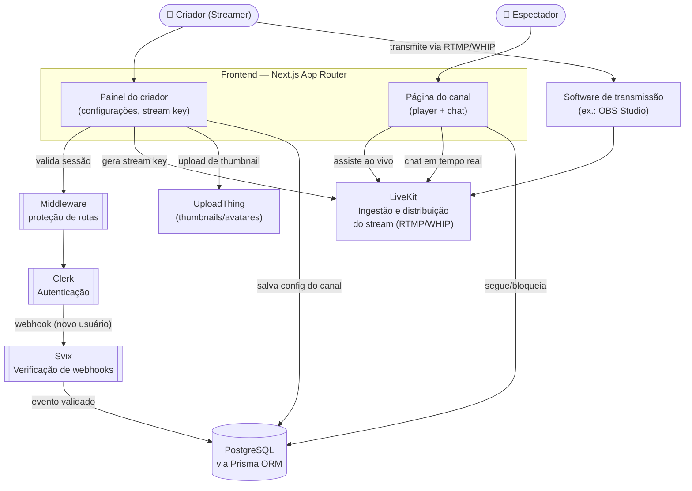

<div align="center">

# 🎮 Streamly

### Plataforma de live streaming — transmissões ao vivo, chat em tempo real e gestão de canais

[](https://nextjs.org)
[](https://react.dev)
[](https://www.typescriptlang.org)
[](https://clerk.com)

</div>

---

## 📋 Sobre o projeto

**Streamly** é uma plataforma de transmissão de vídeo ao vivo, no estilo **Twitch**, construída com **Next.js** e **Clerk** para autenticação. A proposta é permitir que criadores façam **live streaming**, tenham um **chat em tempo real** com a audiência, sistema de **seguidores** e um **painel de gerenciamento de canal**.

> ⚠️ **Nota de transparência importante:** o repositório está em **estágio inicial** (apenas 2 commits até o momento desta análise). O `package.json` atual contém somente o **scaffold de autenticação e UI** (`@clerk/nextjs`, `@clerk/themes`, Radix UI, Tailwind) — as dependências de streaming ao vivo (ex.: LiveKit), banco de dados (ex.: Prisma) e upload de mídia (ex.: UploadThing) **ainda não foram adicionadas** ao projeto.
>
> Este README documenta duas coisas separadamente: **(1) o que já existe hoje** no repositório, e **(2) a arquitetura-alvo**, inferida do padrão consolidado de projetos "Twitch Clone" com essa mesma strutura de pastas (`app/`, `components/`, `lib/`, `middleware.ts`) — tipicamente construídos com Next.js + Clerk + LiveKit + Prisma + UploadThing + Svix. Use a seção de arquitetura como um guia do que **construir a seguir**, não como descrição do estado atual do código.

---

## ✅ O que já existe no repositório

| Item | Descrição |
|---|---|
| 🔐 **Autenticação** | Integração com **Clerk** (`@clerk/nextjs`, `@clerk/themes`) já configurada |
| 🛡️ **Middleware** | `middleware.ts` presente na raiz — provavelmente protegendo rotas autenticadas |
| 🎨 **UI base** | Tailwind CSS + Radix UI (`react-slot`) + `class-variance-authority`, com `components.json` (shadcn/ui) |
| 🌗 **Tema** | `next-themes` configurado (suporte a dark mode) |
| 📁 **Estrutura de pastas** | `app/`, `components/`, `lib/`, `public/` já criados |

---

## 🎯 Arquitetura-alvo (funcionalidades planejadas)

| Funcionalidade | Descrição |
|---|---|
| 🔴 **Transmissão ao vivo** | Streaming de baixa latência (RTMP/WHIP) via LiveKit |
| 💬 **Chat em tempo real** | Chat ao vivo por canal, com moderação |
| 👥 **Seguidores** | Sistema de "seguir" canais/criadores |
| 🚫 **Bloqueio de usuários** | Criadores podem bloquear espectadores do chat |
| 🔑 **Chave de stream** | Geração/gestão de stream key para transmitir via OBS ou similar |
| ⚙️ **Painel do criador** | Configurações do canal, thumbnail, nome da live |
| 🚦 **Rate limiting** | Proteção contra abuso no chat/API |

---

## 🛠️ Tech Stack

### Já presente no `package.json`

| Camada | Tecnologia |
|---|---|
| **Framework** | Next.js 14 (App Router), React 18 |
| **UI** | Tailwind CSS, Radix UI, shadcn/ui, `lucide-react` |
| **Autenticação** | Clerk |
| **Linguagem** | TypeScript 5 |

### Tipicamente usado em projetos deste tipo (ainda não presente aqui)

| Camada | Tecnologia sugerida |
|---|---|
| **Streaming ao vivo** | [LiveKit](https://livekit.io/) (`livekit-client`, `livekit-server-sdk`, `@livekit/components-react`) |
| **Banco de dados / ORM** | PostgreSQL + [Prisma](https://www.prisma.io/) |
| **Upload de imagens** | [UploadThing](https://uploadthing.com/) (thumbnails, avatares) |
| **Verificação de Webhooks** | [Svix](https://www.svix.com/) (eventos do Clerk) |
| **Estado global** | Zustand |

---

## 🏗️ Arquitetura-alvo



### Como o fluxo deve funcionar

1. O **criador** se autentica via **Clerk** e, no **painel do criador**, configura seu canal (nome, thumbnail via UploadThing) e obtém sua **stream key**.
2. Usando um software de transmissão (ex.: **OBS Studio**), o criador envia o stream via **RTMP/WHIP** para o **LiveKit**, que faz a ingestão e distribuição de baixa latência.
3. **Espectadores** acessam a página do canal, onde o player consome o stream diretamente do LiveKit e participam do **chat em tempo real** (também via LiveKit ou um canal de dados dedicado).
4. Ações como seguir um canal ou bloquear um usuário são persistidas no banco de dados (**PostgreSQL via Prisma**).
5. Eventos do Clerk (ex.: criação de usuário) chegam via **webhook**, validados com **Svix**, e sincronizam o usuário com o banco de dados da aplicação.

> Esta é a arquitetura de referência para este tipo de projeto — implemente-a de acordo com suas necessidades reais à medida que o código avança.

---

## 📁 Estrutura do projeto (atual)

```
twitch-clone/
├── app/                  # Rotas e páginas (Next.js App Router)
├── components/           # Componentes de UI reutilizáveis
├── lib/                  # Funções utilitárias, configs
├── public/               # Assets estáticos
├── components.json       # Configuração do shadcn/ui
├── middleware.ts         # Middleware de proteção de rotas (Clerk)
├── next.config.mjs
├── tailwind.config.ts
├── postcss.config.mjs
├── tsconfig.json
├── .eslintrc.json
├── package.json
└── README.md
```

---

## 📜 Scripts disponíveis

| Comando | Descrição |
|---|---|
| `npm run dev` | Inicia o servidor de desenvolvimento |
| `npm run build` | Gera o build de produção |
| `npm run start` | Inicia o servidor em modo produção |
| `npm run lint` | Roda o ESLint no projeto |

---

## 🗺️ Roadmap

- [ ] Integrar **LiveKit** para ingestão e distribuição do stream
- [ ] Adicionar **Prisma** + banco de dados (usuários, canais, seguidores)
- [ ] Implementar **chat em tempo real** por canal
- [ ] Adicionar **UploadThing** para thumbnails/avatares
- [ ] Configurar **webhooks do Clerk** com verificação via Svix
- [ ] Painel do criador (stream key, configurações do canal)
- [ ] Sistema de seguidores e bloqueio de usuários
- [ ] Testes automatizados
- [ ] Definir licença do projeto

